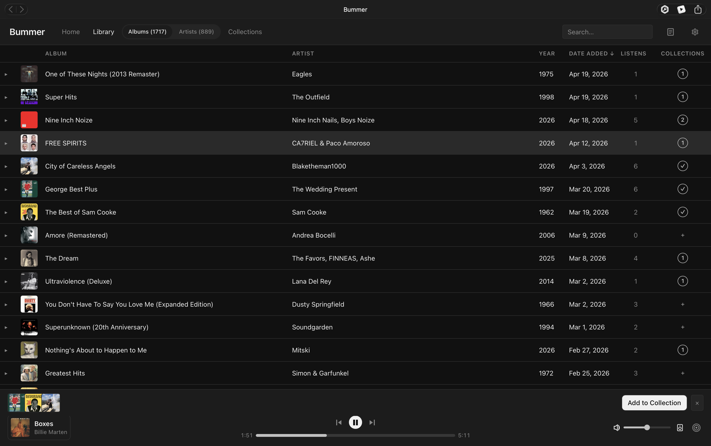
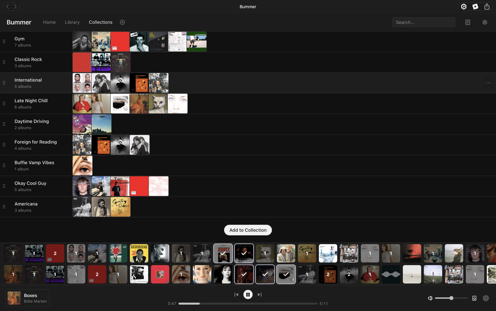
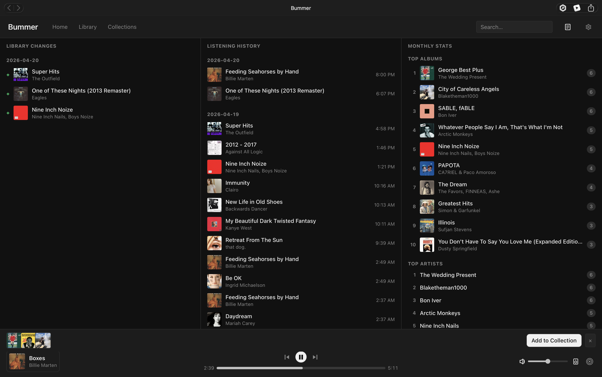

# Bummer

A personal music library manager that syncs with Spotify and provides a more intentional music listening experience. Album-first. Curation-first. The death of shuffle.

**Live at [thedeathofshuffle.com](https://thedeathofshuffle.com)**

## Screenshots

| Home | Library |
|------|---------|
|  |  |

| Collections | Changelog |
|-------------|-----------|
|  |  |

## What it does

- Sync your Spotify library and browse it as a proper album catalog
- Create collections of albums, not just playlist of songs.
- Group and explore by artist.
- Playback supported Spotify Connect.
- Track your library at it changes with a weekly digest.

## Feedback

Bummer is a personal project. Your feedback is welcome, I'm excited to build a better tool for us:

- **Found a bug?** [File an issue](https://github.com/toofanian/bummer/issues/new?template=bug.yml)
- **Have a feature idea?** [Start a discussion](https://github.com/toofanian/bummer/discussions/categories/ideas) — upvote existing ideas or propose new ones
- **Browse the backlog:** [Project board](https://github.com/users/toofanian/projects/3)

